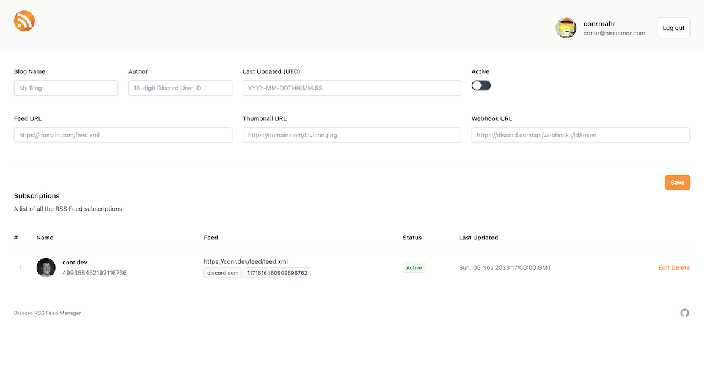

# Discord RSS Feed Manager (Forked)

RSS and Atom feeds to Discord webhooks with web management UI.

## Usage

### Development

- Install Node 18+ and npm, and run `yarn install`.
- For the web interface run `yarn run check` and `yarn run dev`.
- For the RSS poller run `yarn run build:runner` and `yarn run runner`.

### Configuration

The service can be configured using environment variables:

- `INTERVAL` (default 15) minutes between checks
- `REDIS_URL` (required) redis connect url
- `AUTH_SECRET` (required) random generated secret
- `AUTH_TRUST_HOST` (required) boolean
- `DISCORD_CLIENT_ID` (required) https://discord.com/developers/applications
  - Make sure to add `http://localhost:5173/auth/callback/discord`, or the production equivalant, to your OAuth2 redirects section.
- `DISCORD_CLIENT_SECRET` (required) https://discord.com/developers/applications
- `DISCORD_AUTHORIZED_USERS` (required) comma-separated list of Discord user IDs for users allowed to access and modify the configuration

## Screenshots

## Credits

- @3ventic For building the original version
- @javorszky & @cassidoo For inspiration and putting it to good use
